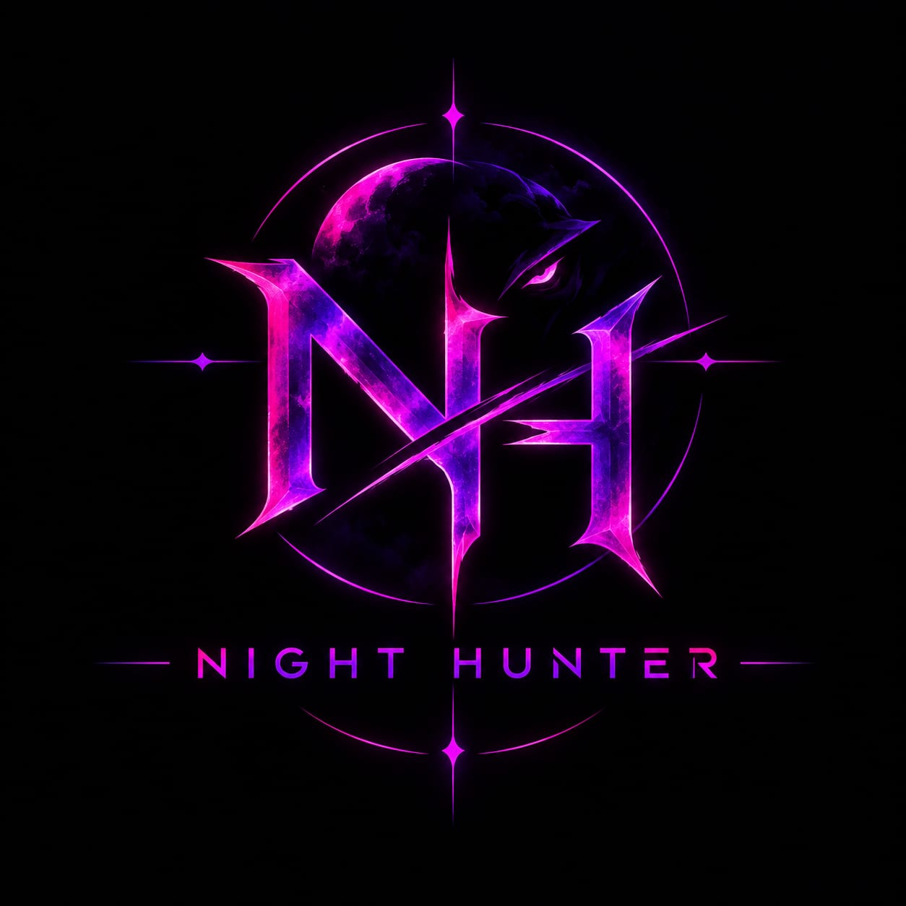

# 🦇 NIGHT HUNTER

<p align="center">
  
</p>

<p align="center">
  <strong>Next-Generation Defensive Security & Threat Intelligence Command Center</strong><br />
  <em>Auditing · Target Reconnaissance · Network Intelligence · Phishing Detection</em>
</p>

<p align="center">
  <a href="https://github.com/halderarnab827/Night-Hunter/raw/main/releases/NightHunter.exe"></a>
  <a href="https://night-hunter-f2w4.onrender.com"></a>
  <a href="LICENSE"></a>
  <a href="#"></a>
  <a href="#"></a>
</p>

---

## ⚡ Overview

**Night Hunter** is an all-in-one defensive security workbench built for cybersecurity researchers, ethical hackers, system administrators, and developers. It consolidates multiple critical security disciplines—web vulnerability auditing, local LAN & Nmap device reconnaissance, phishing heuristics, credential strength auditing, and cryptographic hashing—into an intuitive, modern command center.

Night Hunter operates in two complementary modes:
1. **Desktop / Cloud Graphical Workspace**: A fast cyberpunk UI built with React & Vite.
2. **Terminal CLI Engine**: A command-line toolkit tailored for headless Linux servers, Kali Linux, and Android Termux environments.

🌐 **Official Live Web Application:** [night-hunter-f2w4.onrender.com](https://night-hunter-f2w4.onrender.com)  
📦 **Official GitHub Releases:** [Releases Directory](https://github.com/halderarnab827/Night-Hunter/tree/main/releases)

---

## 📥 Latest Downloads (v1.6.2)

| Platform | Package | GitHub Direct Link | Web Mirror Link | Verified SHA-256 |
|---|---|---|---|---|
| **Windows 10 / 11** | Standalone Executable (`.exe`) | [**NightHunter.exe**](https://github.com/halderarnab827/Night-Hunter/raw/main/releases/NightHunter.exe) | [Mirror](https://night-hunter-f2w4.onrender.com/downloads/NightHunter.exe) | `03e389104b...` |
| **Linux (Kali/Ubuntu)** | Terminal Edition (`.tar.gz`) | [**night-hunter-linux.tar.gz**](https://github.com/halderarnab827/Night-Hunter/raw/main/releases/night-hunter-linux.tar.gz) | [Mirror](https://night-hunter-f2w4.onrender.com/downloads/night-hunter-linux.tar.gz) | `e17b5acc...` |
| **Android (Termux)** | Mobile Terminal (`.zip`) | [**night-hunter-termux.zip**](https://github.com/halderarnab827/Night-Hunter/raw/main/releases/night-hunter-termux.zip) | [Mirror](https://night-hunter-f2w4.onrender.com/downloads/night-hunter-termux.zip) | `1c194cec...` |

---

## 🛡️ Core Modules & Capabilities

### 1. 🌐 Web Security Intelligence
* **Security Headers Audit**: Verifies presence and strength of `Content-Security-Policy`, `Strict-Transport-Security`, `X-Frame-Options`, `X-Content-Type-Options`, and more.
* **Technology & Server Profiling**: Fingerprints web servers, backend runtimes, and frontend frameworks.
* **Cookie & Endpoint Inspection**: Identifies insecure cookies (`Secure`, `HttpOnly`, `SameSite`) and reviews exposed endpoints.

### 2. 📡 Network Security & Nmap Reconnaissance
* **LAN Device Discovery**: Pinpoints target devices on the local network (Wi-Fi / Ethernet).
* **OS Model Fingerprinting**: Remote heuristics and Nmap fingerprinting to classify operating systems and device models.
* **Dual TCP & UDP Scanner**: Scans key ports with service identification, including UDP service discovery (`-sU`).
* **MAC Address & Vendor Resolution**: Resolves hardware MAC addresses to hardware manufacturers on local segments.

### 3. 🎣 Phishing & Link Analyzer
* **Passive Threat Evaluation**: Evaluates suspicious links without rendering harmful payloads or malicious scripts.
* **Brand Spoofing & Impersonation**: Flags high-risk brand mimicry, typo-squatting, and deceptive character substitutions (IDN homoglyphs).
* **Structural Risk Score**: 100-point heuristic risk scoring with detailed severity findings and defensive remediation advice.

### 4. 🔑 Password Security & Credential Audit
* **Entropy & Pattern Analysis**: Checks character diversity, keyboard patterns, common wordlists, and dictionary sequences.
* **Breach Risk Guidance**: Real-time evaluation against industry safety standards.
* **Cryptographic Token Generator**: Creates cryptographically random credentials tailored to custom complexity constraints.

### 5. 🧮 Cryptographic Lab
* **Multi-Algorithm Hashing**: Instantly generates MD5, SHA-224, SHA-256, SHA-384, SHA-512, SHA3, BLAKE2b, and BLAKE2s digests simultaneously.
* **Encoding / Decoding**: Quick conversions across Base64, Hexadecimal, URL Encoding, and ROT13.

### 6. 📑 Security Reporting
* **Multi-Format Export**: Generates defensive audit reports in JSON, TXT, or styled HTML formats.
* **Audit Logs**: Tracks past scan activities locally on your machine.

---

## 🚀 Quick Start & Installation

### Option 1: Windows (Standalone .exe — Direct Application)
1. Download **[`NightHunter.exe`](https://github.com/halderarnab827/Night-Hunter/raw/main/releases/NightHunter.exe)** (or from [Web Mirror](https://night-hunter-f2w4.onrender.com/downloads/NightHunter.exe)).
2. Double-click `NightHunter.exe` to run.
   > *Note: Windows SmartScreen may show "Windows protected your PC" because this is an open-source binary without an expensive commercial EV certificate. Click **"More info"** &rarr; **"Run anyway"**.*
3. Your browser automatically opens the dashboard at `http://127.0.0.1:5000`.

---

### Option 2: Linux (Kali Linux, Ubuntu, Debian, Arch)
Run the following in your terminal:

```bash
# 1. Download release archive (from GitHub or Web Mirror)
wget https://github.com/halderarnab827/Night-Hunter/raw/main/releases/night-hunter-linux.tar.gz

# 2. Extract archive
tar -xzf night-hunter-linux.tar.gz
cd night-hunter-linux

# 3. Run the automated installer
bash install.sh

# 4. Launch anytime from any directory
NightHunter
```

---

### Option 3: Android (Termux)
Turn your Android smartphone into a portable defensive audit device:

```bash
# 1. Open Termux and navigate to your storage
cd ~/storage/downloads

# 2. Download and unzip
curl -LO https://github.com/halderarnab827/Night-Hunter/raw/main/releases/night-hunter-termux.zip
unzip night-hunter-termux.zip
cd night-hunter-termux

# 3. Run the installer
bash termux-install.sh

# 4. Launch
NightHunter
```

---

### Option 4: Run Directly from Source

```bash
# Clone the repository
git clone https://github.com/halderarnab827/Night-Hunter.git
cd Night-Hunter

# Install Python requirements
pip install -r requirement.txt

# Start backend server
python api/server.py

# (Optional) Run CLI version directly
python main.py
```

---

## 🔒 Verification, Trust & Policies

To verify downloaded binaries against tamper-proof checksums:
* Checksum registry: [SHA256SUMS](SHA256SUMS)
* [Privacy Policy](PRIVACY.md)
* [Security Policy & Responsible Disclosure](SECURITY.md)
* [Distribution & Package Notes](DISTRIBUTION.md)

---

## 💻 Tech Stack & Architecture

| Layer | Technology |
|---|---|
| **Frontend** | React 19, Vite, Tailwind-style modular CSS, Lucide Icons |
| **Backend API** | Python 3, Flask, Flask-CORS |
| **Reconnaissance Engine** | Socket network primitives, Nmap integration, Scapy heuristics |
| **Packaging** | PyInstaller (Single-file Windows executable), Shell installers |
| **Deployment** | Render Cloud PaaS (Dockerized multi-stage build) |

---

## ⚖️ Legal Disclaimer & Limitation of Liability

> [!CAUTION]
> **PLEASE READ CAREFULLY BEFORE USING THIS SOFTWARE**

This software, **Night Hunter**, is designed, developed, and distributed solely for **educational, defensive, authorized system auditing, and security research purposes**.

1. **Authorized Usage Only**: You must only use Night Hunter on networks, hosts, devices, and websites that you own or where you have received **explicit, prior written permission** from the system owner or network administrator.
2. **Prohibited Activities**: Scanning, auditing, stress-testing, or reconnaissance conducted against third-party systems without prior authorization is illegal and violates computer crime laws, including the **United States Computer Fraud and Abuse Act (CFAA)**, the **UK Computer Misuse Act**, the **Indian Information Technology Act (IT Act 2000)**, and equivalent international cybersecurity legislation.
3. **Limitation of Liability & Developer Indemnification**: 
   - **Under no circumstances shall the author, developers, contributors, or copyright holders be held responsible or legally liable for any damages, losses, legal actions, network disruptions, data corruption, or legal claims resulting from the misuse, abuse, or unauthorized deployment of this software.**
   - The end user accepts full and sole responsibility for compliance with all applicable local, national, and international laws and regulations.
4. **No Warranty**: This software is provided "AS IS", without warranty of any kind, express or implied, including but not limited to the warranties of merchantability, fitness for a particular purpose, and noninfringement.

---

## 🤝 Contributing

Contributions, feature suggestions, and security research improvements are welcome!

1. Fork the repository (`git fork`)
2. Create your feature branch (`git checkout -b feature/AmazingSecurityModule`)
3. Commit your changes (`git commit -m 'feat: add enhanced recon rule'`)
4. Push to the branch (`git push origin feature/AmazingSecurityModule`)
5. Open a **Pull Request**

---

## 📜 License

Distributed under the **MIT License**. See [`LICENSE`](LICENSE) for more details.

---

<p align="center">
  Crafted with care by <a href="https://github.com/halderarnab827"><strong>Arnab Halder</strong></a> and community contributors.<br />
  <em>Stay ethical. Defend your perimeter. Protect the web.</em>
</p>
